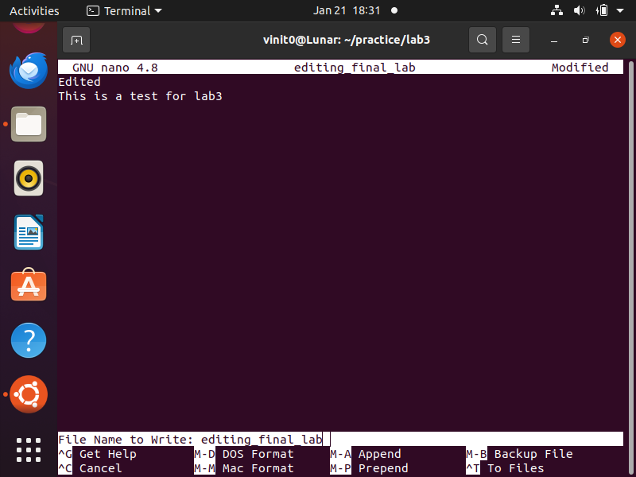
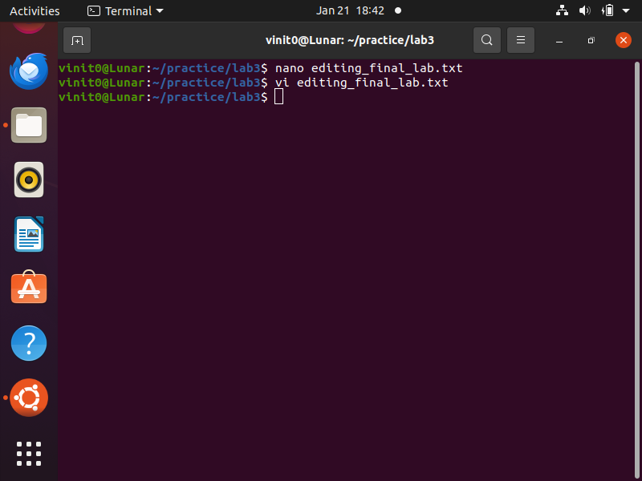

# Linux-Administration

# Linux Class Labs

## Lab1
- **Objective**: Practice using the `touch` and `mkdir` commands to create files and directories.
- **Commands Used**:-
touch song{1..6}.mp3 snap{1..6}.jpg film{1..6}.avi
mkdir friends family work

## Screenshot of Lab1

# Lab 2: Using man Pages and Brace Expansion

## Objectives
1. Learn to use the `man` command to view manual pages for commands.
2. Use `man -k` to search for commands by keyword.
3. Practice using brace expansion for generating strings.

---

## Commands Used
man {commands}
man -k ext4
echo {file1,file2,file3}.txt
echo {A..C}1

# Lab 3: Editing Files with Vim and Nano

## Objectives
1. Practice editing files using `vim` and `nano`.
2. Learn how to enter visual mode in `vim` and modify text interactively.
3. Modify a file as per the given instructions.

---

## Steps and Commands

### 1. Editing with Vim
Commands:
vi editing_final_lab.txt

### 2. Editing with Nano
Commands:
nano editing_final_lab.txt

Initially editing_final_lab was
EditingFile
This is a test for Lab 3
Another line for practice

